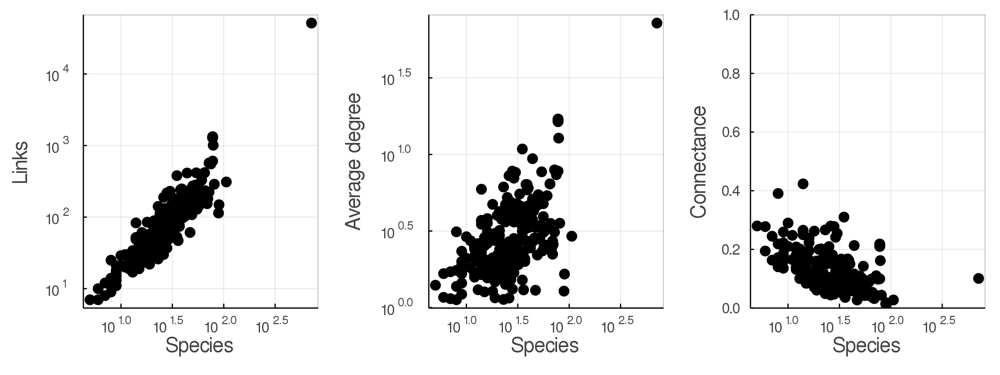
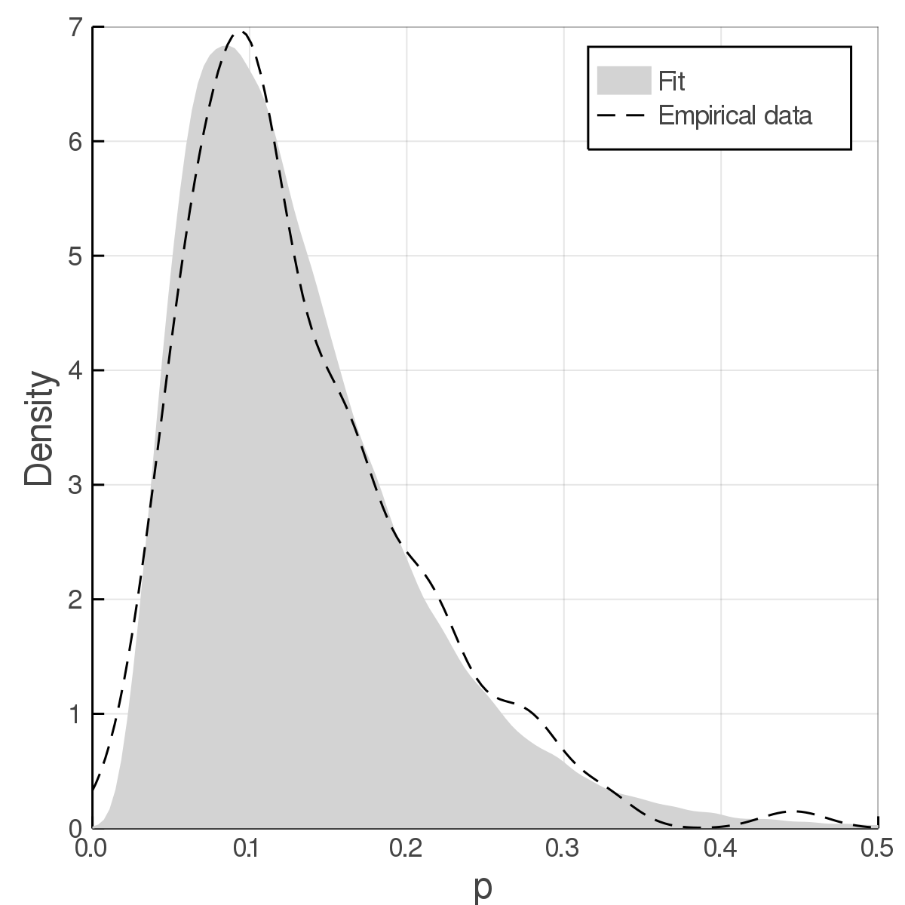
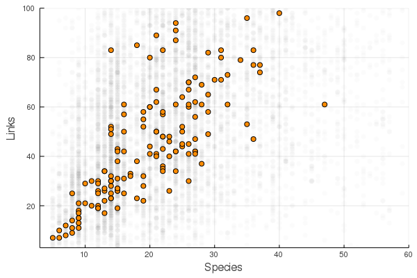
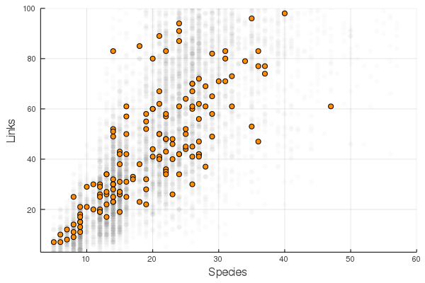
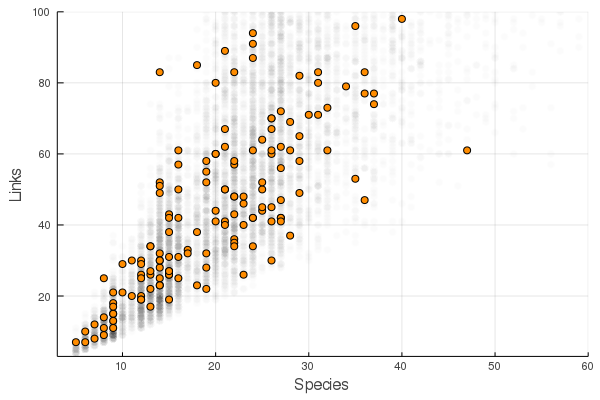
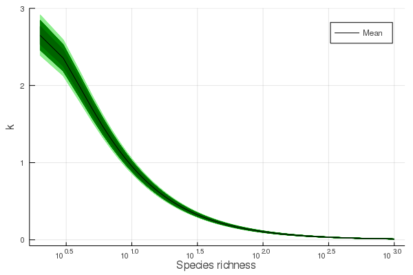

# Introduction

Community ecologists are fascinated by counting things. It is therefore no
surprise that early food web literature paid so much attention to counting
species, counting trophic interactions, and computing the relationship of these
quantities. It is clear to any observer of nature that of all imaginable trophic
interactions in a community, only a fraction actually occur. This ratio is
termed "connectance" and has become a fundamental quantity for nearly all
aspects of food web structure and dynamics [@PascDunn06]. More species always
means more interactions; this scaling between species richness $S$ and number of
interactions $L$ is universal and appears both in observed webs and under purely
neutral models of food web structure [@CanaMouq12]. Various functional forms
have been suggested as possible models for $L$; @BrosOstl04 suggested a power
law, with $L = b\times S^a$. Power laws are very flexible, and indeed this
function matches empirical data well.

Historical efforts to predict link number have produced numerous candidate models, of which the power law is the most general.
- Early predictions differ in whether this is a linear of exponential relationship
- Has consequences for spatial scaling (Brose)
While flexible, the power law relationship is limited because the parameters are difficult to reason about ecologically.
This is in part because many mechanisms can produce power-law shaped relationships.

The number of links in a foodweb does not simply scale with the number of
species: it also must obey constraints fixed by biology. These constraints
determine both the maximum and minimum number of links in a web. The maximum
number of links is $S^2$. In such a community, every species eats all others,
including members of the same species. The minimum number, assuming at least
some species are heterotrophs, is $S-1$. Numerous simple foodwebs could have
this number of links -- for example, a linear food chain wherein each trophic
level consists of a single species, each of which consumes only the species
below it. These constraints have not been used in previous attempts to model the
relationship between $L$ and $S$. This makes prediction difficult, since models
without this constraint can make unrealistic predictions of link number.

When making predictions is it often helpful to use generative models, which can
create simulated data with the same properties as observations. Creating such a
model involves two key components: a mathematical expression which represents
the ecological process being studied, and a distribution which represents our
observations of this process. Either of these components can capture our
ecological understanding of a system, including any constraints on the
quantities studied. Here we suggest a new perspective for a model of $L$ as a
function of $S$. In our model described below, our distribution of observations
is a binomial distribution, which models the number of realized links
("successes") out of the total number possible ("trials"). This automatically
includes the maximum constraint, since the number of species determines the
number of trials. We include the minimum constraint by modelling not the total
number of links, but the number in excess of the minimum, which we term
"flexible" links. Our process model is extremely simple: it is a single
parameter, a constant which gives the proportion of these flexible links which
are realized. Because food webs vary in the precise value of this proportion, we
model it with a beta distribution, which allows some variation around the
average value. The resulting model is therefore beta-binomial.

In this paper we will describe this new approach to modelling $L$, and show how
it compares to previous models. We estimate parameters for this model using open
data from the `mangal.io` networks database (+@fig:empirical). Finally, we show
how this model for $L$ suggests a new and more useful way of predicting network
structure. Finally, we discuss how generative models can be useful devices for
including our knowledge of a system into our predictions.

{#fig:empirical}

### Models of link number

Several other models have been used to predict the number of links in a food
web; all of these have modeled the number of links directly, usually after
transformation. We fit several of these models, as well as our own, to compare
their predictive ability.

@CoheBria84 hypothesized that all networks would have the same average degree,
resulting in link-species scaling expressed as

$$\hat L_\text{LSSL} = b\times S\,,$${#eq:lssl}

where $S$ is the species richness, and $b \approx 2$. @Mart92 instead suggested
that most networks should have constant connectance, expressed as $L/S^2$, and
therefore one can predict the number of interactions as

$$\hat L_\text{CC} = b\times S^2\,,$${#eq:cc}

where $b$ is a constant in $]0,1[$. Finally, @BrosOstl04 note that these two
models are instead parameterizations of the same general model, in which

$$\hat L_\text{reg} = b\times S^a\,, $${#eq:reg}

where $a$ and $b$ are constants. When the number of links and number of
interactions are transformed by their natural log, $a$ and $b$ can be estimated
with a linear regression, as done by @Mart92.

Although all of these models fit the data well enough, they neglect a
fundamental piece of ecological knowledge about food webs: as identified by
@Mart92, the number of links $L$ in a food web with $S$ nodes can be no lower
than $S-1$, and no higher than $S^2$. Another way of expressing this idea is
that because we observe a food web with $S$ species, we are guaranteed to
observed at least $S-1$ interactions. From a predictive standpoint, this means
that we need to figure out how much of the remaining interactions, out of
$S^2-(S-1)$, will be realized. Following @PoisCirt16, we suggest that each of
these interactions are instances of independent Bernoulli trials with a set
probability of success $p$, which much like $a$ and $b$ in +@eq:reg is assumed
to be a constant across all food webs.

This means that the number of predicted links can be expressed as:

$$
 \hat L = p\times\left[S^2-(S-1)\right]+(S-1)\,.
$${#eq:lhat}

This can be re-expressed as a second order polynomial:

$$\hat L = p\times S^2 + (1-p)\times S + (p-1)\,. $${#eq:L}

# Fitting the model

We have rephrased the question of connectance in food webs as the proportion of
links realized above the minimum. There are several ways of writing down this
model; we compare two possibilities below. In both cases, we use a discrete
probability distribution as the likelihood, with the number of observed links
$L_i$ above the minimum as 'successes' and the number of possible links as
'trials'. Each model tries to capture variation in link number greater than
would be predicted by $p$ alone.

Our first model uses the Beta-Binomial distribution for observations of $L$;
this distribution can be parameterized in terms of its mean $\mu_p$ and
concentration parameter, $\phi$ :

$$\begin{aligned}
L_i & \sim \text{BetaBinomial}(\left[S_i^2-(S_i-1)\right], p \times \phi, (1 - p) \times \phi)\\
p &\sim  \text{Beta}(1.54, 9.49)\\
\log(\phi) & \sim \text{Normal}(3, 0.5)
\end{aligned}$${#eq:betab}

We chose our prior distribution for $p$ based on @Mart92 , who gave a value of
constant connectance equal to 0.14. While this prior is "informative", it is
weakly so; as @Mart92 did not provide an estimate of the variance for his value
we chose a relatively large variation around that mean.  However, as no
information is available to inform a prior on $\phi$, we followed the advice of
(tk Simpson et al), and performed prior predictive checks. We chose prior
parameters that generated a wide range of values for $L_i$, but which did not
frequently predict webs of either maximum or minimum connectance, neither of
which are observed in nature. The prior we use here can be thought of as
beginning with a uniform prior and observing only one interaction among nine
species.

We use Stan [**tk references**] which implements Bayesian inference using
Hamiltonian Monte Carlo. We ran all models using four chains and 2000 iterations
per chain. All models converged with no divergent iterations.

## estimating hyperparameters

While the full posterior distribution can be sampled using various bayesian
conditioning engines, this is not necessary for obtaining point estimates of $p$
and $\phi$. A maximum likelihood estimate of each can be calculated by
rearranging equation {#eq:lhat} and fitting a Beta distribution to the result:

{#fig:penciltrick}

# Results and discussion

Our beta-binomial model outperforms previous solutions to the problem of
modelling $L$.

Table [tk] PSIS-LOO values for the three models we contrast. Pareto-smoothed
important sampling serves as a guide to model selection; like other information
criteria it approximates the error in cross-validation predictions. Smaller
values indicate a model which makes better predictions.

| model         | PSIS-LOO | SE  |
| ------------- | -------- | --- |
| Constant      | 2798     | 104 |
| Power law     | 2595     | 49  |
| Beta Binomial | 2543     | 46  |

*Alternative table* (TP)

| model         | reference   | Δ PSIS-LOO | SE  |
| ------------- | ----------- | ---------- | --- |
| Beta Binomial |             | 0          | 46  |
| Power law     | @BrosOstl04 | 52         | 49  |
| Constant      | @Mart92     | 255        | 104 |

All models fit without any divergent iterations. However, the calculation of
PSIS-LOO for the constant connectance model warned of a shape parameter greater
than 0.7, which suggests that the model is not robust to extreme observations.
The Beta-Binomial model had the most favourable values of PSIS-LOO information
criteron (Table). Which suggests that it will make the best predictions. More
importantly, only the Beta Binomial model makes predictions which respect the
constraints set by ecological principles

{#fig:constconn}

Constant connectance model makes many predictions which are only approximate.

{#fig:pwrlaw}

The power law model makes predictions which are closer to observed values, but
they are frequently too low

{#fig:bbin}

The beta binomial makes roughly the same predictions as the power law, but in
this case they are held within biologically possible values.

## Connectance is constant (for large enough food webs)

Because we have an expression for the number of interactions (+@eq:L), we can
get an expression for the expected connectance, which is

$$
  \frac{\hat L}{S^2} = p\frac{S^2}{S^2} + (1-p)\frac{S}{S^2}+(p-1)\frac{1}{S^2} \,.
$$

This results in the connectance being expressed as

$$ \frac{\hat L}{S^2} = (p-1)\times S^{-2} + (1-p)\times S^{-1} + p \, ,$${#eq:co}

or equivalently as

$$ \frac{\hat L}{S^2} = p + (1-p)\times m(s) \, ,$${#eq:co2}

where $m(s) = \frac{S - 1}{S^{2}}$ is the minimal connectance of a food web.

Note that the expression of connectance is no longer a polynomial; at large
values of $S$, the value of $m(s)$ (equivalently the terms in $S^{-1}$ and
$S^{-2}$) will tend towards 0, and so the connectance will converge towards $p$.
Therefore, for large enough ecological networks, we should expect a connectance
which is independent of $S$. Thus $p$ has an interesting ecological
interpretation: it represents the average connectance of networks large enough
that the proportion $\frac{(S-1)}{S^{2}}$ is negligible.

Interestingly, this model still results in an expected average degree ($\hat
L/S$, the *linkage density*) for a large number of species that scales with $S$:

$$\frac{\hat L}{S} = p\times S + (1-p) + (p - 1)\times S^{-1}\,.$$

This means that the addition of $p^{-1}$ new species should increase the average
degree in the food web by 1; of course, for increasingly large values of $S$,
this may result in unrealistic average degree, as species are limited by
biological mechanisms such as handling time, capture efficiency, etc, in the
number of interactions they can establish. Seeing how most ecological networks
are reasonably small, this does not look like an unreasonable assumption.

## Distribution of connectance

We have fit a Beta distribution to links in excess of the minimum. However,
since the minimum connectance is a function of S (specifically $m(S) =
\frac{S-1}{S^2}$), we can derive the distribution for connectances directly:

$$ p_{Co} = (1 - m(S)) \times p + m(S)\, ,$$ {#eq:pco}
$$ \phi_{Co} = \frac{\phi + m(S)}{1 - m(S)}\, .$$ {#eq:phico}

The expression for $p_{Co}$ is identical to {#eq:co2} above. As S becomes large,
$p_{Co}$ and $\phi_{Co}$ converge to $p$ and $\phi$ respectively. That is, for
species-rich communities the minimal connectance becomes negligible, and the
distribution of connectances is stationary, with a constant mean and variance.

The distribution of connectances has several important uses. First, it can be
used as an informative prior when constructing future food webs. Cirtwill et al.
proposed using a Beta distribution for the probability of any specific edge in a
food web. The prior defined above may be used in this way. Note that if
multiplied by $S^2$, the above expression is equal to {#eq:L}, the expected
number of links in a food web [@PoisCirt16].

In addition to use as a prior, the distribution of connectances can also be used
to test whether networks are more or less connected than expected by chance.
Using parameters $p$ and $\phi$, and adjusting for the observed number of
species $S$, a food web ecologist may read the p-value associated with their
observed connectance directly from a Beta distribution. Equivalently, one may
instead choose to describe the distribution of links, rather than connectances.
In our model, the distribution of links is beta-binomial, with hyperparameters
$p_{Co}$ and $\phi_{Co}$. By the deMoivre-Laplace theorem, a binomial
distribution may be approximated with a normal distribution. This allows us to
convert an observed number of links directly into a z-score, without resorting
to null distributions derived from samples

Finally, a regularized value of connectance can be obtained for every site,
directly from the parameters estimated in #eq:betab:

$$ \widetilde{Co_i} = \frac{L_i + \phi p}{S^2 + \phi}\, , $$

This partially pools the observed connectance towards the population average,
$p$. The strength of this pooling is controlled by $\phi$. This could be useful
when estimating the connectance for very small webs, and as another means to
measure the "departure" of a community from an expectation.

## Only very-large food webs obey a power law

As noted by @BrosOstl04, the models of @CoheBria84 and @Mart92 results in
networks in which the relationship between $L$ and $S$ obeys a power-law, albeit
with different parameters. Our model does not make this prediction, due to the
fact that we explicitly account for the lower bound of $(S-1)$ interactions. In
+@eq:L, the term $p\times S^2$ will become increasingly important when $S$
increases, and so we can quantify the extent to which the relationship gets
closer to a power law when $S$ increases.

We do so by dividing the terms with exponents lower than 2 by the term with
exponent 2, which gives

$$k = \frac{(1-p)\times S + (p-1)}{p\times S^2}\,.$$

This will peak for small values of $S$, and then slowly decrease towards 0. We
illustrate these results in +@fig:powerlawk, which reveals that for networks under
**500?** species, the relationship between $S$ and $L$ strongly deviates from a
power-law. Specifically, **complete -- is it under or over-estimating the number
of interactions?**.

In a sense, this model sheds some light on a classical result [@DunnWill02a]:
ecological networks deviate most strongly from the expectations under "small
world" or "scale free" regimes when they exceed a certain connectance; this is
because for small networks, connectance is higher, and only decreases towards
$p$ when the term in $S^{-2}$ in +@eq:co vanishes.

{#fig:powerlawk}

## We can derive a measure of departure from expected number of links

Because $p$ is the probability of a number $n = S^2 - (S-1)$ of independent
Bernoulli events, we can express the variance of the number of interactions in
excess of $(S-1)$ as $n\times p\times (1-p)$. This means that given a network
with observed species richness $S$ and observed links $L$, we can calculate its
$z$-score as

$$z = \frac{(L -(S-1)) - p\times \left[S^2-(S-1)\right]}{\sqrt{p\times (1-p)\times \left[S^2-(S-1)\right]}} \,.$${#eq:z}

A network where $L = \hat L$ will have a $z$-score of 0, and any network with
more (fewer) interactions will have a positive (negative) $z$-score. This has
important practical consequences - the structure of ecological networks is often
probed for deviation from the random distribution of some measure of interest
(**ref Bascompte, Flores**), and most of these measures are in turn related to
connectance **ref P&G**; therefore, *to be continued*.

## Conclusions

<!-- moving this to end because I don't really know where it fits in the narrative -->
@WillMart04 identified that most food webs appear to be limited in their height,
as increasingly apical species require more energy flowing in to be sustained.
In addition, constraints on omnivory appear to "linearize" food-webs; there
should therefore be a limitation on the richness of a food web, and so for small
values of $S$, the difference between assuming that there can be between $0$, or
between $(S-1)$, and $S^2$ interactions is likely biologically relevant.

# References
