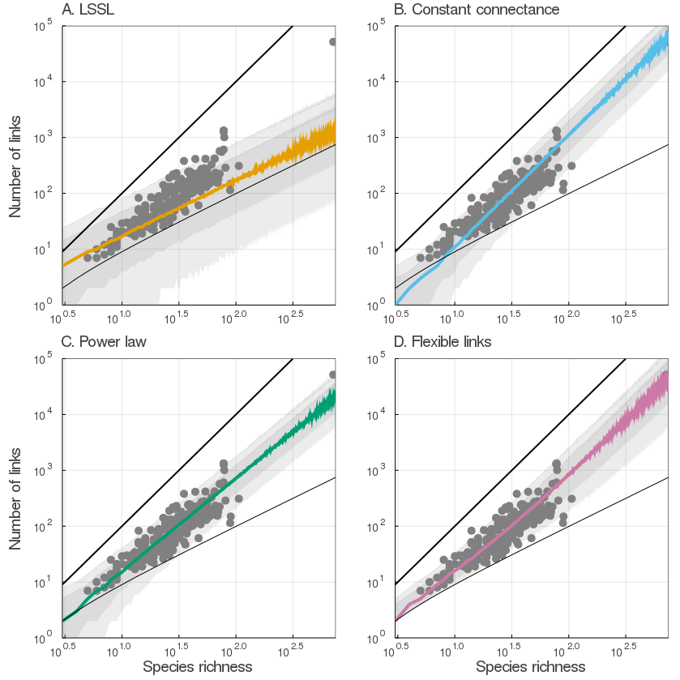
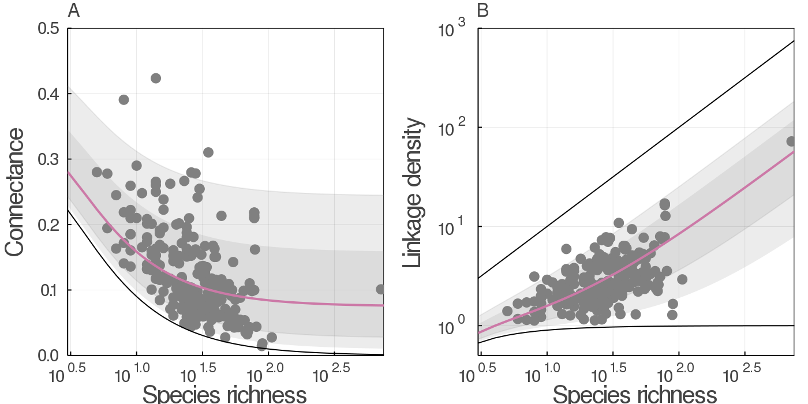
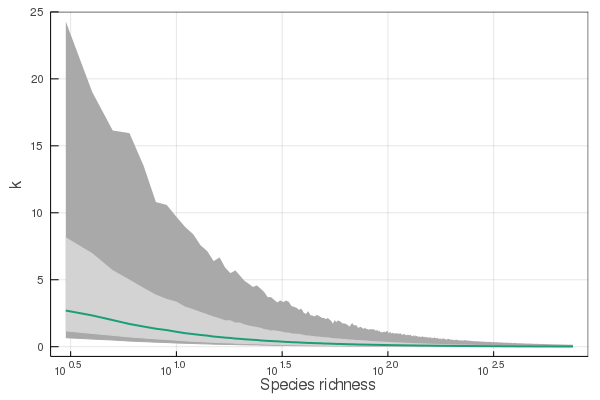
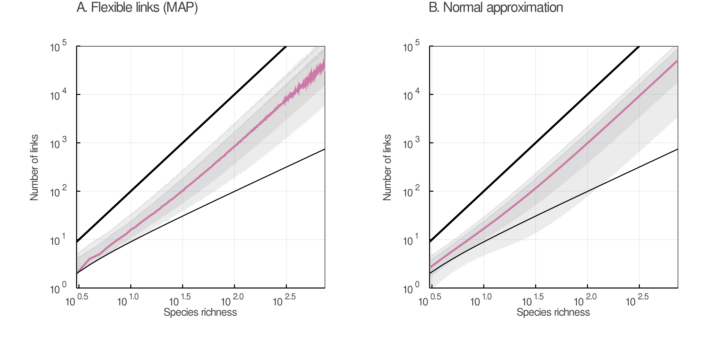

# Introduction

Community ecologists are fascinated by counting things. It is therefore no
surprise that the early food web literature paid so much attention to counting
species, counting trophic interactions, and computing the relationship between these numbers.
More species always
means more interactions; this scaling between species richness $S$ and number of
interactions $L$ is universal and appears both in observed webs and under purely
neutral models of food web structure [@CanaMouq12].
In fact, these numbers underlie most <!-- all?? --> means of describing a food web.
Accurately predicting both is essential when trying to model food web structure.
Food web structure, in turn, is very important for understanding how ecological systems function, develop, and respond to changes.

Three specific quantities are emphasized by food web ecologists.
The most straightforward is $L$, the number of trophic interactions among species.
This quantity can be large, especially in species-rich habitats, but it cannot be arbitrarily large.
It is clear to any observer of nature that of all imaginable trophic
interactions, only a fraction actually occur.
If an ecological community contains $S$ species, then the maximum number of links in its foodweb is $S^2$: a community of omnivorous cannibals.
Ecologists have therefore often chosen to define a ratio, called "connectance": $Co = L/S^2$.
Connectance has become a fundamental quantity for nearly all other measures of food web structure and dynamics [@PascDunn06].
The third important quantity is another ratio: $L/S$, or the "average degree" of nodes in a food web.
This ratio expresses the average number of species with which any taxa is expected to interact, either as predators or prey.
Accurate predictions of ecological networks are extremely useful in many ecological contexts; thus it is important to have an ecologically accurate predictive model for the underlying value, $L$.

Because $L$ represents such a fundamental quantity, many predictive models have been considered over the years.
The current favourite is a power-law relationship:  $L = b\times S^a$.
Power laws are a popular means of describing scaling relationships in many parts of science and were first applied to food webs by @BrosOstl04.
Power laws are very flexible, and indeed this
function matches empirical data well -- so well that it is often treated as a "true" model which captures the scaling of link number with species richness.
Prior to the introduction of the power law relationship, common models included assuming that $L$ was in constant proportion to either $S$ or $S^2$.
These models all have clear shortcomings.
While flexible, the power law relationship is limited because the parameters are difficult to reason about ecologically.
This is in part because many mechanisms can produce power-law shaped relationships.
One weakness which all models have in common is their very flexibility: they can produce predicted values of $L$ which are ecologically impossible.
<!-- fuse these paragraphs?  -->
The number of links in a foodweb does not simply scale with the number of
species: it also must obey constraints fixed by biology.
These constraints determine both the maximum and minimum number of links in a web.
As discussed, the maximum number of links is $S^2$; the minimum number, assuming at least some species are heterotrophs, is $S-1$. To be part of a foodweb, a species must have a trophic relationship with at least one other species in the connected network.
Numerous simple foodwebs could have this minimal number of links -- for example, a linear food chain wherein each trophic
level consists of a single species, each of which consumes only the species below it.
These constraints have not been used in previous attempts to model the
relationship between $L$ and $S$. This makes prediction difficult, since models without this constraint can make unrealistic predictions of $L$.

<!-- generative is useful .. to the end of the paper? -->
Generative models are flexible and powerful tools for understanding and predicting natural phenomena.
These models aim to
create simulated data with the same properties as observations.
Creating such a model involves two key components: a mathematical expression which represents
the ecological process being studied, and a distribution which represents our observations of this process.
Both of these components can capture our ecological understanding of a system, including any constraints on the
quantities studied.

Here we suggest a new perspective for a model of $L$ as a
function of $S$.
In our model described below, our distribution of observations
is a shifted beta-binomial distribution, which models the number of links which actually exist out of the total number possible.
This automatically
includes the maximum constraint, since the number of species determines the
number of possible links. We include the minimum constraint by modelling not the total
number of links, but the number in excess of the minimum, which we term
"flexible" links. Our process model is extremely simple: it is a single
parameter, a constant which gives the proportion of these flexible links which
are realized. Because different food webs will have different values of this proportion, we
model it with a beta distribution, which allows some variation around the
average value. The resulting model is therefore beta-binomial.

Several models have been used to predict the number of links in a food
web.
We fit three of these models, as well as our proposed shifted Beta-binomial, and compare their predictive ability. Here we briefly introduce each model before providing our own.

The link-species scaling (LSSL) model introduced by @CoheBria84 hypothesized that all networks have the same average degree (_i.e._ number of links per species). Links are modeled as the number of species times a constant:

$$\hat L_\text{LSSL} = m\times S\,,$${#eq:lssl}

where $S$ is species richness, and $m \approx 2$.

@Mart92 instead suggested that the number of links should be in proportion to the _square_ of species richness:

$$\hat L_\text{CC} = c\times S^2\,,$${#eq:cc}

where $c$ is a constant in $]0,1[$.
This is called the  *constant connectance* model, because it implies a constant ratio $L/S^2$ for all networks.
This model was a first attempt to recongize the constraint discussed above: no network can have more than $S^2$ interactions.

Finally, @BrosOstl04 note that these two
models are instead special cases of the same general model, in which

$$\hat L_\text{reg} = b\times S^a\,, $${#eq:reg}

where $a$ and $b$ are constants.

Although all of these models fit the data well enough, they neglect a
fundamental piece of ecological knowledge about food webs: as identified by
@Mart92, the number of links $L$ in a food web with $S$ nodes can be no lower
than $S-1$, and no higher than $S^2$. Another way of expressing this idea is
that because we observe a food web with $S$ species, we are guaranteed to
observed at least $S-1$ interactions. From a predictive standpoint, this means
that we need to figure out how many of the remaining interactions, out of a possible
$S^2-(S-1)$, will be realized. Below, we refer to this quantity as the number of "flexible" links in a food web.
Following @PoisCirt16, we suggest that each flexible link represents an independent Bernoulli trial with a probability  $p$ of existing.
We assume that $p$ is a constant for all links in the same ecological community.

This means that the number of predicted links can be expressed as:

$$
 \hat L_{BB} = p\times\left[S^2-(S-1)\right]+(S-1)\,.
$${#eq:lhat}

We use the symbol $L_{BB}$ to represent our estimate of $L$, because our model defines a Beta-Binomial likelihood (derivation in Experimental Procedures).

<!-- Francis to write a paragraph summarizing Experimental Proc -->

<!-- tk: rather than merging with previous, I like this as a means of giving a summary of the whole paper. -->
In this paper we will describe this new approach to modelling $L$, and show how
it compares to previous models. We estimate parameters for this model using open
data from the `mangal.io` networks database. Finally, we show
how this model for $L$ suggests a new and more useful way of predicting network
structure and discuss how generative models can be useful tools for including our knowledge of a system into our predictions.

# Results and Discussion

### Beta Binomial model fits better and makes a plausible range of predictions
Our beta-binomial model outperforms previous solutions to the problem of
modelling $L$. For explanation of the model derivation, fitting, and comparison, see Experimental Procedures.

Table [tk] PSIS-LOO values for the three models we contrast. Pareto-smoothed
important sampling serves as a guide to model selection; like other information
criteria it approximates the error in cross-validation predictions. Smaller
values indicate a model which makes better predictions. The expected log predictive density (ELPD)
measures the predictive performance of the model; here, higher values indicate more reliable predictions.

<!-- elpd table -- calculated with LOO -->
| model                 | reference                  | PSIS-LOO       | Δ elpd   | SE     |
|-----------------------|----------------------------|----------------|----------|--------|
| Shifted Beta Binomial |                            | 2520.5 44.4    | 0        | 0      |
| Power law             | @BrosOstl04                | 2564.3 46.6    | -21.9    | 6.5    |
| Constant              | @Mart92                    | 2811.0 68.3    | -145.3   | 21.1   |
| Link-species scaling  | doi 10.1098/rspb.1985.0042 | 39840.1 2795.1 | -18659.8 | 1381.7 |

The Beta-Binomial model had the most favourable values of PSIS-LOO information
criterion (Table) and of expected log predictive density (ELPD) which suggests that it will make the best predictions of $L$. More
importantly, only the shifted Beta-Binomial model makes predictions which respect the
constraints set by ecological principles.
Information criteria are only a rough guide to model selection; as always domain expertise should take precedence. In both respects, the shifted Beta-Binomial model outperforms alternatives in predicting the distribution of $L$.

All models fit without any divergent iterations, which indicates that is it safe to make inferences about the parameter estimates and to compare the models.
However, the calculation of
PSIS-LOO for the LSSL model warned of problematic values of the Pareto-k diagnostic statistic. This indicates that the model is heavily influenced by large values.
Additionally, we had to drop the largest observation (> 50 000 links) from all datasets in order to calculate PSIS-LOO for the LSSL model.
Taken together, this suggests that the LSSL model is insufficiently flexible to accurately reproduce the data.  

{#fig:PP_counterfactual}
The constant connectance model makes many predictions which are only approximate. The power law model makes predictions which are closer to observed values, but
they are frequently too low. The beta binomial makes roughly the same predictions as the power law, but in
this case they are held within biologically possible values.

### Parameter estimates for all models

Table [tk] **Parameter estimates for all models**. Mean and Standard deviation (SD) is given for each parameter.
| model                | parameter | interpretation                        | value | SD  |
|----------------------|-----------|---------------------------------------|-------|-----|
| Link-species scaling | $m$       | number of links per species           | 2.2     | 0.047  |
| Constant connectance | $c$       | proportion of maximum links realized  | 0.12     | 0.0041  |
| Power law            | $a$       | no unique meaning                 | 0.37    | 0.054  |
|                      | $b$       | no unique meaning                 | 1.7   | 0.043 |
| Shifted BetaBinomial | $\mu$     | proportion of flexible links realized | 0.086 | 0.0037    |
|                      | $\phi$    | concentration around value of $\mu$   | 24.3  |  2.4   |

{#fig:beta_distributions}

### Connectance and average degree can be derived from a model for links

We have used a discrete distribution to model $L$, but we can also define continuous measures for two important network metrics: connectance ($L/S^2$) and average degree ($L/S$). This can be done by recalling the hierarchical interpretation of the Beta Binomial distribution

The distribution for $L$ is a discrete beta binomial, but it is possible to use the values of $\mu$ and $\phi$ to parameterize a continuous distribution for each of these two quantities. We use the same $Beta(\mu \phi, (1-\mu) \phi)$ distribiton for $p$, but shift and rescale it according to the range for each variable

The connectance of a food web is bounded by 0 and 1. However, the minimum bound on links similarly imposes a lower value on connectance.
This means that the distribution for $Co$ will be a shifted Beta distribution, a transformed version of the distribution for $p$

Because we have an expression for the number of interactions (+@eq:L), we can also get an expression for the expected connectance, which is

$$
  \frac{\hat L}{S^2} = p\frac{S^2}{S^2} + (1-p)\frac{S}{S^2}+(p-1)\frac{1}{S^2} \,.
$$

This results in the connectance being expressed as

$$ \frac{\hat L}{S^2} = (p-1)\times S^{-2} + (1-p)\times S^{-1} + p \, ,$${#eq:co}

or equivalently as

$$ \frac{\hat L}{S^2} = p(1 - m(S)) + m(S) ,$${#eq:co2}

where $m(S) = (S - 1)/S^{2}$ is the minimal connectance of a food web.

Note that the expression of connectance is no longer a polynomial; at large
values of $S$, the value of $m(S)$ (equivalently the terms in $S^{-1}$ and
$S^{-2}$) will tend towards 0, and so the connectance will converge towards $p$.
Therefore, for large enough ecological networks, we should expect a connectance
which is independent of $S$. Thus $p$ has an interesting ecological
interpretation: it represents the average connectance of networks large enough
that the proportion $(S-1)/S^{2}$ is negligible.

We can convert the distribution for $p$ into one for $Co$ by replacing $p$ with a transformation of $Co$ as described above, and rescaling by the new range:

$$
[Co | S, \mu, \phi] = \frac{\left(Co - m(S)\right)^{\mu \phi - 1}\left(1 - Co\right)^{(1 - \mu)\phi - 1} }{(1 - m(S))^{\phi - 1} \times B(\mu \phi, (1 - \mu)\phi)}
$${#eq:shiftBetaCo}

This distribution can be parameterized using hyperparameters $\mu$ and $\phi$ estimated from the beta-binomial model above.

Interestingly, this model still results in an expected average degree ($\hat
L/S$, the *linkage density*) for a large number of species that scales with $S$:

$$\frac{\hat L}{S} = pS + (1-p) + (p - 1) S^{-1}\,.$$

or equivalently:

$$\frac{\hat L}{S} = p S + (1-p)\frac{(S-1)}{ S}\,.$$

This means that the addition of $p^{-1}$ new species should increase the average
degree in the food web by slightly more than 1; of course, for increasingly large values of $S$,
this may result in unrealistic average degree, as species are limited by
biological mechanisms such as handling time, capture efficiency, _etc_, in the
number of interactions they can establish. Most ecological networks
are reasonably small and so this does not look like an unreasonable assumption.

$$
[L_{D} | S, \mu, \phi] = \frac{\left(L_D - \frac{S-1} {S}\right)^{\mu \phi - 1}\left(1 - L_D\right)^{(1 - \mu)\phi - 1} }{(S - \frac{S-1}{S})^{\phi - 1} \times B(\mu \phi, (1 - \mu)\phi)}
$${#eq:shiftBetaLD}

#### why use distributions for $Co$ and $Ld$

## Only very large food webs obey a power law

As noted by @BrosOstl04, the models of @CoheBria84 and @Mart92 results in
networks in which the relationship between $L$ and $S$ obeys a power-law, albeit
with different parameters. Our model does not make this prediction, due to the
fact that we explicitly account for the lower bound of $(S-1)$ interactions. In
+@eq:L, the term $p\times S^2$ will become increasingly important when $S$
increases, and so we can quantify the extent to which the relationship gets
closer to a power law when $S$ increases.

We do so by dividing the terms with exponents lower than 2 by the term with
exponent 2, which gives

$$k = \frac{(1-p)\times S + (p-1)}{p\times S^2}\,.$$

This will peak for small values of $S$, and then slowly decrease towards 0. We
illustrate these results in +@fig:powerlawk, which reveals that for networks under approximatively 120 species, the relationship between $S$ and $L$ strongly deviates from a
power-law ($k > 0.1$). In small networks, the terms with exponents lower than 2 in +@eq:L are non negligible when compared to the power law $p\times S^2$, which therefore considerably under-estimates their number of interactions.

This model sheds some light on a classical result [@DunnWill02a]:
ecological networks deviate most strongly from the expectations under "small
world" or "scale free" regimes when they exceed a certain connectance; this is
because for small networks, connectance is higher, and only decreases towards
$p$ when the term in $S^{-2}$ in +@eq:co vanishes.

{#fig:powerlawk}

## Normal approximation provides an analytic z-score

Ecologists are often faced with the issue of comparing several networks.
Often, they wish to know if the network they have is "unusual" relative to some expectation.
Traditionally these comparisons have been done by constructing a Null distribution .
But here we propose a means of doing so with math.

The beta binomial can be approximated by a Normal distribution

$$ L \sim Normal(\bar{L}, \sigma_L^2) $$

$$ \bar{L} = (S^2 - S + 1) \mu + S - 1$$

$$ \sigma_L^2 = (S^2 - S + 1) \mu (1 - \mu)(1 + \frac{S(S-1)}{\phi + 1})$$

(+@fig:MAPnormal) shows that the predictions made by the normal approximation (panel B) are similar to those made by the beta distribution parameterized with the maximum a posteriori values of $\mu$ and $\phi$ (panel A).

{#fig:MAPnormal}

This means that given a network
with observed species richness $S_{obs}$ and observed links $L_{obs}$, we can calculate its
$z$-score as

$$z = \frac{L_{obs} - \bar{L}}{\sqrt{\sigma_L^2}} \,.$${#eq:z}

A network where $L = \hat L$ will have a $z$-score of 0, and any network with
more (fewer) interactions will have a positive (negative) $z$-score. This has
important practical consequences - the structure of ecological networks is often
probed for deviation from the random distribution of some measure of interest
(**ref Bascompte, Flores**), and most of these measures are in turn related to
connectance **ref P&G**.

We argue that the use of a $z$-score could help identify significantly under (over) sampled networks and estimate their number of missing (extra) links.

### Ecological networks in large-scale studies

Data collection on ecological interactions can be challenging. Although a network could be built based on databases and literature review, this often does not account for the inherent spatiotemporal variability of interaction between co-occurring species. A probability distribution for connectance non only accounts for that variability, but can be used to describe some of the most fundamental properties of ecological networks. Connectance has indeed been linked to more than a dozen metrics on the structure of networks, and represent the simultaneous effects of specific ecological and evolutive mechanisms.

We believe that the appropriate modeling of the number of interactions can allow scientists to tackle a wide variety of ecological questions, which otherwise could have been left unexplored. For instance, the functions (productivity, resilience, _etc._) and dynamics of ecological networks at large spatial or temporal scales could be more easily explored. It also facilitates the conduction of network studies in regions where interaction data is lacking, notably due to geographical and/or financial reasons.

It is nevertheless worth mentioning here that our ability to model the number of links in an ecological network does not diminish the value of data collection. Among others, data on interspecific interactions helps understanding more deeply an ecological community and the relationship between two or more species, as well as making better predictions in the statistical modelling of networks.

## Conclusions

<!-- moving this to end because I don't really know where it fits in the narrative -->
@WillMart04 identified that most food webs appear to be limited in their height,
as increasingly apical species require more energy flowing in to be sustained.
In addition, constraints on omnivory appear to "linearize" food-webs; there
should therefore be a limitation on the richness of a food web, and so for small
values of $S$, the difference between assuming that there can be between $0$, or
between $(S-1)$, and $S^2$ interactions is likely biologically relevant.

# Experimental Procedures

## Bayesian model definitions

$$
[L | a, ϕ] = \text{NegBin}(a S, \phi)
$$

## explanation of shifted Beta Binomial distribution

<!-- tk: move this 2nd order polynomail down to where it actually features in an argument

This can be re-expressed as a second order polynomial:

$$\hat L = p\times S^2 + (1-p)\times S + (p-1)\,. $${#eq:L} -->

Equation [tk eq:L] implies that $\hat L_{BB}$ has a binomial distribution, with $S^2 - S + 1$ trials and a probability $p$ of any flexible link being realized:

$$
[L | S, p] = { S^2 - (S - 1) \choose L - (S - 1)} p^{L-(S-1)}(1-p)^{S^2 - L} ,
$$

This is often termed a _shifted Binomial distribution_.

We also note that ecological communities are different in many ways besides their number of species ($S$). Although we assume $p$ to be fixed within one community, the precise value of $p$ will change from one community to another.
With this assumption, our likelihood becomes a shifted beta-binomial distribution:

$$
[L|S,\mu, \phi] =  { S^2 - (S - 1) \choose L - (S - 1)} \frac{B(L - (S - 1) + \mu \phi, S^2 - L + (1 - \mu)\phi)}{B(\mu \phi, (1 - \mu)\phi)}
$${#eq:shiftBB}

Where $B$ is the Beta function.

When the number of links and number of
interactions are transformed by their natural log, $a$ and $b$ can be estimated
with a linear regression, as done by @Mart92.
Here, because we want to compare all our models WAIC, we were required to use a discrete likelihood in all cases.
We fit the three models above with a negative binomial distribution for observations.
This distribution is limited to positive integers, and can vary on both sides of the mean relationship; this gives it a similar spirit to previous work which used a normal distribution on log-transformed variables.

In all models we use a discrete
probability distribution as the likelihood, with the number of observed links
$L_i$ above the minimum as 'successes' and the number of possible links as
'trials'. Each model tries to capture variation in link number greater than
would be predicted by $p$ alone.

Our first model uses the Beta-Binomial distribution for observations of $L$;
this distribution can be parameterized in terms of its mean $\mu$ and
concentration parameter, $\phi$ :

<!-- tk a better notation here; possibly imitating H&H's style?? -->

$$\begin{aligned}
\mu &\sim  \text{Beta}(3, 7)\\
\log(\phi) & \sim \text{Normal}(3, 0.5)
\end{aligned}$${#eq:betab}

We chose our prior distribution for $p$ based on @Mart92 , who gave a value of
constant connectance equal to 0.14. While this prior is "informative", it is
weakly so; as @Mart92 did not provide an estimate of the variance for his value
we chose a relatively large variation around that mean.  However, as no
information is available to inform a prior on $\phi$, we followed the advice of
(tk Simpson et al), and performed prior predictive checks. We chose prior
parameters that generated a wide range of values for $L_i$, but which did not
frequently predict webs of either maximum or minimum connectance, neither of
which are observed in nature.

### Data used to fit all models

<!-- tk describe Mangal and its awesomeness in more wholeness -->
We evaluated our model against 255 empirical foodwebs, available in the online database `mangal.io`

We use Stan (tk doi 10.18637/jss.v076.i01) which implements Bayesian inference using
Hamiltonian Monte Carlo. We ran all models using four chains and 2000 iterations
per chain. All models converged with no divergent iterations.

# References
