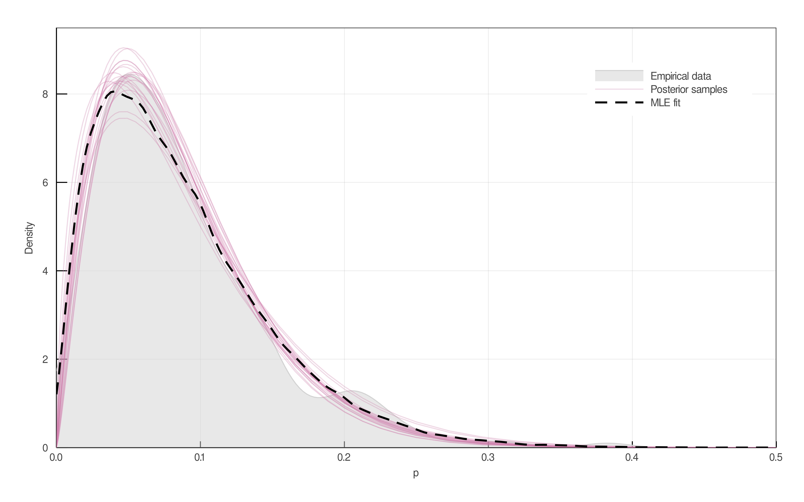

# 1 - Beta fit

## Parameters can be estimated by Maximum Likelihood

While the full posterior distribution can be sampled using various bayesian
machinery, this is not necessary for obtaining point estimates of $p$
and $\phi$. A maximum likelihood estimate of each can be calculated by
rearranging equation {#eq:lhat} and fitting a Beta distribution to the result:

{#fig:penciltrick}

We include this result because ecologists may wish to apply our methods for estimating $L$, $Co$ or $L/S$ without fitting a Bayesian posterior of their own. This approach loses information about the sample size of webs, but nevertheless provides a close match to both the empirical data and the bayesian posterior.

parameter  | MLE estimate  | MAP estimate
--|---|--
μ  | 0.087  | 0.086 ± 0.0037
ϕ  | 21.0  |  24.3 ± 2.4
